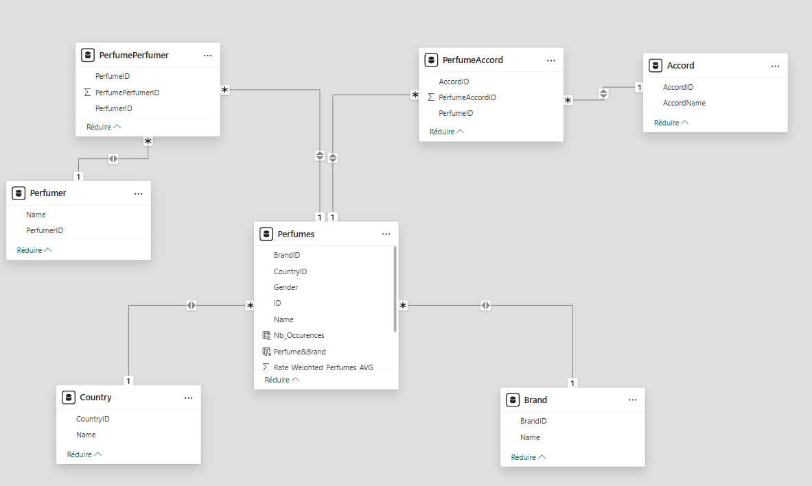
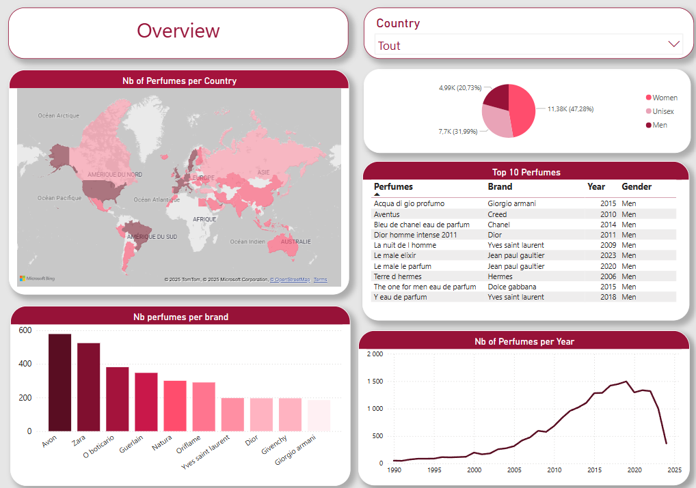
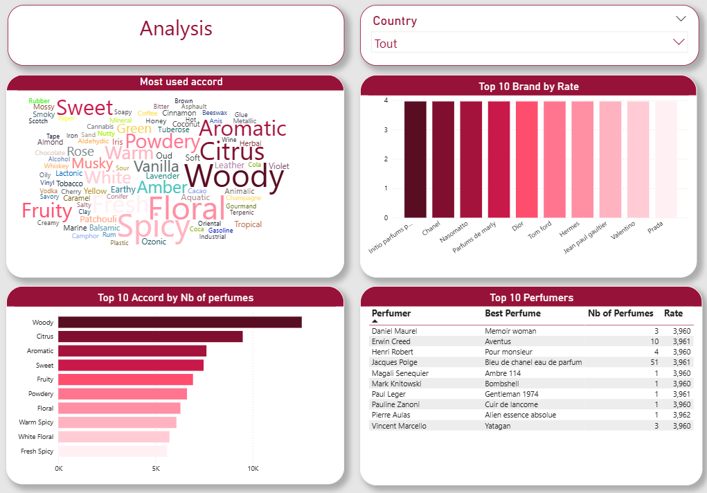
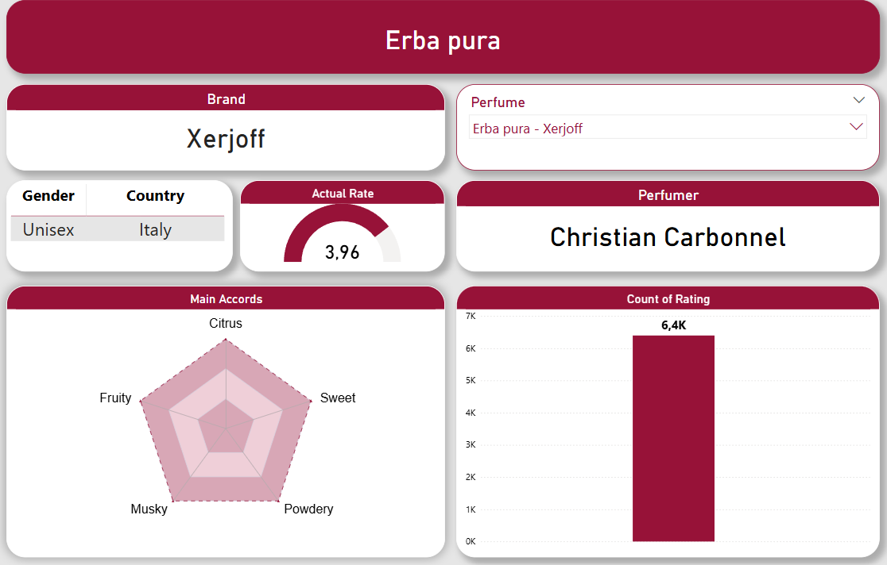

# Power BI Fragrance Analysis Dashboard

This project demonstrates my skills in SQL modeling, data cleaning, and dashboard creation using Power BI and SAP HANA, applied to perfume market analysis based on Fragrantica data.

## General Description
This project is a comprehensive Power BI dashboard that provides an in-depth analysis of perfume trends and market dynamics using data from an Excel file based on Fragrantica information. Designed for perfume vendors, distributors, and marketers, the dashboard offers actionable insights into top-performing perfumes, perfumers, and accords by country and demographic segments. It enables users to make informed decisions by exploring market trends, performance metrics, and customer feedback through an interactive and visually engaging interface.

By integrating advanced data visualization techniques with robust analytics, the dashboard delivers a seamless user experience. Dynamic slicers, interactive charts, and drill-down capabilities allow users to explore both high-level overviews and granular details. The project not only highlights market trends but also identifies growth opportunities by detecting key patterns and correlations within the data.

SAP HANA is used as the primary data storage and processing solution, leveraging its in-memory computing capabilities to efficiently handle and analyze the dataset. This ensures optimized performance when working with the structured data from the Excel file, enabling scalable and efficient analysis for valuable market insights.

## Data Sources

- **Fragrantica Public Data:**  
  Data collected from Fragrantica’s public dataset, serving as the primary source for perfume information.

- **SAP HANA Database:**  
  Utilized for its high-speed, in-memory processing capabilities, SAP HANA stores and extracts large datasets efficiently. SQL queries executed in SAP HANA are used for data modeling, ensuring the data is structured optimally for analysis.

- **Data Cleaning & Transformation:**  
  Custom SQL queries were implemented to clean the raw data. These queries ensure that only valid and complete records are processed further. For example:
  ```sql
    -- Standardize "Perfume" names: replace hyphens with spaces, capitalize first letter, lowercase the rest
    UPDATE "FragranticaData"
    SET "Perfume" = CONCAT(
      UPPER(SUBSTRING(REPLACE("Perfume", '-', ' '), 1, 1)),
      LOWER(SUBSTRING(REPLACE("Perfume", '-', ' '), 2))
    )
    WHERE "Perfume" IS NOT NULL;

   ```
- **Data Modeling:**  
  SQL queries running in SAP HANA were used to model the data. These queries aggregate and structure the cleaned data, making it ready for visualization in Power BI. For example:
  ```sql
    -- Add a weighted average rating column to the Perfumes table
    ALTER TABLE "Perfumes" ADD ("Rate_Weighted_Perfumes_AVG" DOUBLE);
    -- Calculate the weighted average rating for each perfume using Bayesian average
    UPDATE "Perfumes" p
    SET "Rate_Weighted_Perfumes_AVG" = 
        (
            ("Rating Count" * "Rating Value") / 
            (
                "Rating Count" + (SELECT SUM("Rating Count") FROM "Perfumes") * 0.1
            )
            + 
            (
                (SELECT AVG("Rating Value") FROM "Perfumes") * 
                (SELECT SUM("Rating Count") FROM "Perfumes") * 0.1 / 
                ("Rating Count" + (SELECT SUM("Rating Count") FROM "Perfumes") * 0.1)
            )
        );

   ```

- **Power BI Data Model:** Below is the Power BI data model illustrating how the cleaned `FragranticaData` has been transformed into a star schema with one central fact table (`Perfumes`) and linked dimensions (`Brand`, `Country`, `Perfumer`, `Accord`). This structure enables fast, interactive slicing and drilling in Power BI.

**

## Power BI Dashboard Overview

### Global Overview
*Provides a high-level summary of key market metrics including geographical distribution, top-rated perfumes, and launch trends.*

**

- **Country Filter:** Dropdown list to select a country.
- **Geographical Distribution:** Map or chart displaying the distribution of perfumes by country.
- **Top 10 Perfumes by Rating:** Table showcasing the top 10 perfumes, including columns for perfume name, brand, year, and genre.
- **Gender Distribution:** Pie chart illustrating the proportion of perfumes by gender (male, female, unisex).
- **Top 10 Brands:** Stacked bar chart indicating which brands dominate the market.
- **Launch Trends:** Bar chart that visualizes the evolution of perfume launches over the years.


### Analysis
*Delivers deeper insights into brand performance, accord frequency, and perfumer rankings through advanced visualizations.*

**

- **Country Filter:** Dropdown list for country selection.
- **Accords Word Cloud:** Visual representation of the most frequent accords (Main Accord 1-5) in the dataset.
- **Top 10 Brands by Average Rating:** Stacked histogram ranking brands based on the ratio of rating value to rating count.
- **Top 10 Accords:** Stacked bar chart showing the number of perfumes per accord.
- **Top 10 Perfumers:** Table listing the top 10 perfumers along with details such as their best perfume, total number of perfumes, and average rating.


### Detailed View
*Offers granular details for individual perfumes including ratings, associated accords, and demographic breakdowns.*

**

- **Perfume Filter:** Dropdown list to select a specific perfume.
- **Perfumer Map:** Visual representation of perfumer name.
- **Brand Map:** Visual representation of brand origins.
- **Country and Gender Details:** Table displaying detailed country and gender information.
- **Rating Count Chart:** Vertical bar chart showing the number of ratings for the selected perfume.
- **Current Rating Gauge:** Gauge chart that displays the current rating value.
- **Accords Radar Chart:** Radar chart that visualizes the associated accords (without numerical values).


### DAX Measures
Several DAX measures were implemented to enhance interactivity and analytical depth, including:
- **Dynamic Ranking:** For calculating and displaying top-ranked perfumes and brands.
- **Average Rating Calculations:** To provide insights on brand performance and customer satisfaction.
- **Trend Analysis Measures:** To track the evolution of perfume launches over time.

## Outcomes

### Challenges
- **SQL Modeling:** Crafting efficient SQL queries for data cleaning and aggregation.
- **Dynamic Slicers:** Developing interactive slicers to allow users to explore data by country, perfume, and other dimensions.

### Key Insights
- **Market Trends:** Revealed trends in perfume launches and rating distributions across different countries.
- **Brand Performance:** Identified leading brands and perfumers based on customer ratings and market presence.

## Technologies Used
- **Power BI:** For dashboard creation, DAX calculations, and visual storytelling.
- **SQL:** For data transformation and preparation.
- **SAP HANA:** For high-speed, in-memory data processing and scalable storage, ensuring real-time analytics and efficient handling of large datasets.

## Repository Structure
```plaintext
/SAP-POWERBI-PERFUME/
  ├── README.md
  ├── sql-queries/
  │     ├── DataCleaning.sql
  │     ├── DataModeling.sql
  ├── power-bi-dashboard/
  │     ├── perfume_market_analysis.pbix
  │     ├── screenshots/
  │         ├── global_overview.png
  │         ├── analysis.png
  │         ├── detailed.png
  │         ├── data_model.png
```
